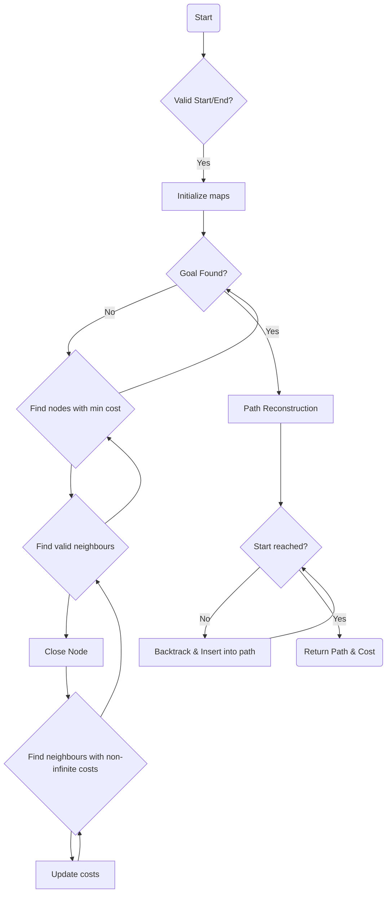

# Graph-Planning
## Introduction

Graph planning algorithms, particularly Dijkstra's algorithm and A*, are fundamental in robotics for pathfinding and navigation in environments with obstacles. Ideal for scenarios where the complete map of the environment is available and finding the optimal path is crucial but real-time constraints might not be a primary concern.

**Objective:** Find the shortest path from a start node to all other nodes in a weighted graph.

**Approach:** Dijistra explores all possible paths radiating outward from the start node, visiting nodes in increasing order of their distance from the start. A* Utilizes heuristics to guide the search by estimating the remaining distance from each node to the goal, combining actual cost and heuristic value to prioritize nodes.

Dijkstra ensures optimality by exploring all possibilities, while A* provides optimality with informed guidance from the heuristic function, often finding solutions more efficiently. A* employs heuristics to guide the search efficiently towards the goal, making it suitable for real-time navigation where rapid pathfinding is crucial. A* typically outperforms Dijkstra in terms of computational efficiency, especially in larger graphs or complex environments, due to its informed search strategy.  In robotics, Dijkstra might be used when a precise, optimal path is necessary, whereas A* is favored for its efficiency in real-time navigation, especially in dynamic environments where paths need constant updates.

## The Algorithm

The algorithm iterates through nodes until the goal node is found and uses various maps (cost_map, open_close_map, parent_map) to keep track of costs, node statuses, and parent-child relationships.
It employs a neighbor exploration strategy based on valid and cost-effective neighbors, updating their costs and parents accordingly.
The path reconstruction uses the parent_map to backtrack from the goal node to the start node.

**1. Initialization:**

- Check for valid start and end nodes and ensure they are not obstacles.
- Create necessary maps: cost_map, open_close_map, and parent_map.
- Initialize cost_map with high costs (1000.0), marking all nodes as unvisited.
- Set the cost of the start node to 0 in cost_map.
- Mark the start node as open in open_close_map.

**2. Main Loop (Goal Search):**

- Enter a while loop that continues until the goal node is found.
- Find the node with the minimum cost among the open nodes (nodes_interest).
- Mark this node as closed in open_close_map.
- Get valid neighbors of this node that are not obstacles and not already closed.
- For each valid neighbor:
- Mark it as open in open_close_map.
- Determine its cost-neighbors (neighbors with known costs).
- Update costs and parents of valid neighbors based on the neighboring costs.
- If the goal node becomes closed, exit the loop (goal found).

**3. Path Reconstruction:**

- Begin path reconstruction by setting node as the end node.
- Insert the end node into the path list.
- Retrieve the total cost by accessing the cost of the end node in cost_map.
- Trace back through the parent_map to reconstruct the path:
- Insert each node's parent into the path list until the start node is reached.

**4. Return:**

- Return the path (list of coordinates) representing the shortest path from start to end.
- Return the cost representing the total cost of the path.

**Difference from A star:**

- The major difference between Dijkstra's algorithm and A* lies in their approach to node exploration and cost evaluation, primarily in the main loop (Goal Search) phase.

- In A*, the modification occurs in the evaluation of the cost function, which combines the actual cost from the start node (g(n)) and a heuristic estimate to the goal node (h(n)). This addition of the heuristic value modifies the way nodes are prioritized for exploration compared to Dijkstra's algorithm.

**Main Loop (Goal Search) for A star:**

**Cost Evaluation:**

- Instead of just considering the accumulated cost from the start (g(n)), A* evaluates a combined cost function f(n) = g(n) + h(n) for each node.
- g(n): Represents the cost of the path from the start node to the current node.
- h(n): Heuristic estimation of the cost from the current node to the goal node.
- f(n): Combined cost function that prioritizes nodes based on their estimated total cost from the start to the goal, considering both actual and estimated costs.

**Node Selection:**

- Select the node with the minimum f(n) value among the open nodes instead of only considering the actual cost (g(n)) as in Dijkstra's algorithm.
- Prioritize nodes based on the f(n) value, balancing the actual cost and the estimated cost to the goal.

**Path Update:**

- Update costs and parents similar to Dijkstra's but considering the modified cost function f(n) for each node.



## Demo

``` python
graph = np.load('sample_graph.npy')
start = [0,0]
end = [25,20]

path_d , cost_d  = dijkstra(graph, start, end)
path_a , cost_a  = a_star(graph, start, end)

```


Sample Path Output: 
[(38, 5), (37, 6), (36, 7), (35, 8), (34, 9), (34, 10), (34, 11), (34, 12), (34, 13), (34, 14), (34, 15), (34, 16), (34, 17), (34, 18), (34, 19), (33, 20), (32, 21), (31, 22), (30, 23), (29, 24), (28, 25), (27, 26), (26, 27), (25, 28), (24, 29), (23, 29), (22, 29), (21, 29), (20, 30)] 

As seen from the above examples, the cost of both the paths calculated is similar (same in this case). However the computation time/ number of iterations required for A* would be much lesser.

## Notes

This was done as a part of the coursework of CSE 568 at the University at Buffalo. The source code is not available publicly to avoid academic integrity violations. Please feel free to contact the author if you wish access to the source code.


